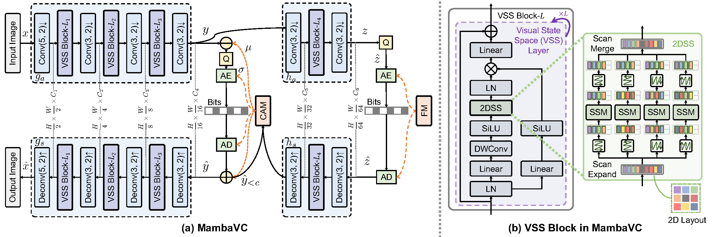
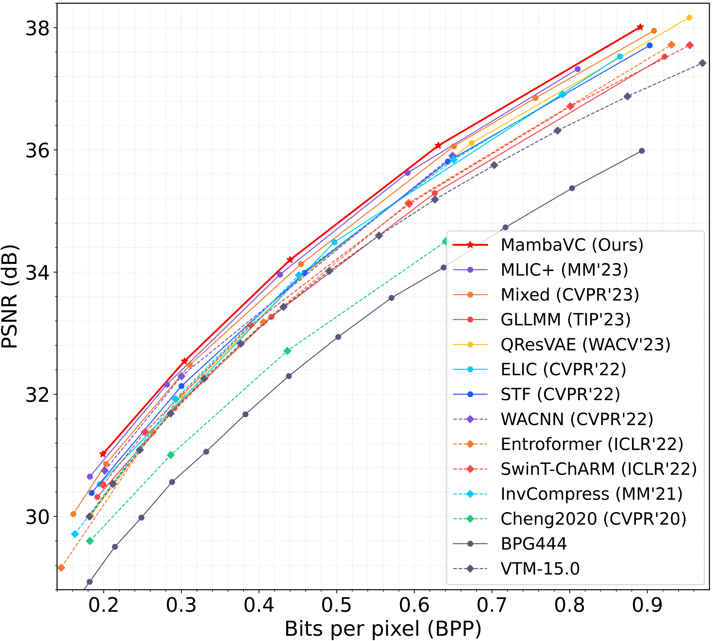

* # MambaVC: Learned Visual Compression with Selective State Spaces

This is the Pytorch repository of the paper "[MambaVC: Learned Visual Compression with Selective State Spaces](https://www.arxiv.org/abs/2405.15413)".

Please feel free to contact Shiyu Qin (qinsy23@mails.tsinghua.edu.cn) if you have any questions.

## Abstract
Learned visual compression is an important and active task in multimedia. Existing approaches have explored various CNN- and Transformer-based designs to model content distribution and eliminate redundancy, where balancing efficacy (i.e., rate-distortion trade-off) and efficiency remains a challenge. Recently, state-space models (SSMs) have shown promise due to their long-range modeling capacity and efficiency. Inspired by this, we take the first step to explore SSMs for visual compression. We introduce MambaVC, a simple, strong and efficient compression network based on SSM. MambaVC develops a visual state space (VSS) block with a 2D selective scanning (2DSS) module as the nonlinear activation function after each downsampling, which helps to capture informative global contexts and enhances compression. On compression benchmark datasets, MambaVC achieves superior rate-distortion performance with lower computational and memory overheads. Specifically, it outperforms CNN and Transformer variants by 9.3% and 15.6% on Kodak, respectively, while reducing computation by 42% and 24%, and saving 12% and 71% of memory. MambaVC shows even greater improvements with high-resolution images, highlighting its potential and scalability in real-world applications. We also provide a comprehensive comparison of different network designs, underscoring MambaVC's advantages.

## Architectures
The overall framework.



## Evaluation Results
RD curves on [Kodak](https://www.kaggle.com/datasets/sherylmehta/kodak-dataset) (trained on [flickr30k](https://shannon.cs.illinois.edu/DenotationGraph/)).



### Dataset

The dataset directory is expected to be organized as below:

<details><summary>dataset_root/</summary>
<ul>
    <li>train/</li>
    <ul>
    	<li>train_1.jpg</li>
    	<li>train_2.jpg</li>
    	<li>...</li>
    </ul>
    <li>test/</li>
    <ul>
    	<li>test_1.jpg</li>
    	<li>test_2.jpg</li>
    	<li>...</li>
    </ul>
</ul>
</details>

## Training
``` 
CUDA_VISIBLE_DEVICES=0 python3 train.py --cuda -d <dataset_root> \
    -n 128 --lambda 0.05 --epochs 500 --lr_epoch 450 490 --batch-size 8 \
    --save_path <ckpt_to_path> --save \
    --checkpoint <resumed_ckpt_path> --continue_train
```

## Testing
``` 
CUDA_VISIBLE_DEVICES=0 python3 eval.py --cuda --data <dataset_root> --checkpoint <pretrained_ckpt_path>
```

## Notes
We use [calflops](https://github.com/MrYxJ/calculate-flops.pytorch) to calculate MACs, FLOPs, and model parameters.

## Citation
```
@article{qin2024mambavc,
  title={MambaVC: Learned Visual Compression with Selective State Spaces},
  author={Qin, Shiyu and Wang, Jinpeng and Zhou, Yiming and Chen, Bin and Luo, Tianci and An, Baoyi and Dai, Tao and Xia, Shutao and Wang, Yaowei},
  journal={arXiv preprint arXiv:2405.15413},
  year={2024}
}
```

## Ackownledgement
Our code is based on the implementation of [CompressAI](https://github.com/InterDigitalInc/CompressAI)/[Mamba](https://github.com/state-spaces/mamba)/[Vmamba](https://github.com/MzeroMiko/VMamba). We thank the authors for open-sourcing their code.